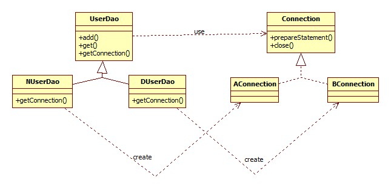

## 1장 오브젝트와 의존 관계

#### 1.1 초난감 DAO

<b>학습 목적</b> : 문제점이 있는 DAO에 대해서 살펴보고 이에 대한 해결책을 생각해 본다.


- #### 기본개념

<b>DAO(Data Access Object)</b> : DB를 사용해 데이터를 조회하거나 조작하는 기능을 담당하는 오브젝트.

<b>자바빈(Java Beans)</b> : 속성과 Setter , Getter 메소드를 가진 자바 Class 


- #### 문제의 DAO

<b>1.1.1 User 클래스</b>

``` java
public class User{
    private String id;
    private String name;
    private String Password;
    
    public String getId() {
		return id;
	}
	public void setId(String id) {
		this.id = id;
	}
	public String getName() {
		return name;
	}
	public void setName(String name) {
		this.name = name;
	}
	public String getPassword() {
		return password;
	}
	public void setPassword(String password) {
		this.password = password;
	}
    
}
```


<b>Users 데이터베이스</b>

| 필드명   | 타입        | 설정        |
| -------- | ----------- | ----------- |
| id       | VARCHAR(10) | Primary key |
| Name     | VARCHAR(20) | Not Null    |
| Password | VARCHAR(20) | Not Null    |

 

<B>1.1.2 UserDao</B>

``` java   
public class UserDao {
    public void add(User user){
        //DB 연결하는 CODE
        //SQL INSERT QUERY
        //연결 종료
    }
    
    public void get(String id){
        //DB 연결하는 CODE
        //SQL SELECT QUERY
        //연결 종료
    }
}
```


<b>1.1.3 문제점</b>

 - UserDao에 정의된 각각의 메소드에 DB접근 로직 부분이 중복되어 있다. 

   => 데이터베이스의 종류를 바꾸고자 하는등의 변경이 있을때 중복된 모든 code를 수정해야함.

   => 데이터베이스의 변경을 제한하는 제한사항이 된다. 

   

* 해결책 
  - 중복되는 코드를 하나의 모듈로 정의하고 그 모듈을 이용한다. 


#### 1.2 DAO의 분리

​	<b>학습 목적</b> : 위에서 제시한 해결책을 실행한다.


<b>1.2.1 관심사의 분리</b>

- 이상적인 설계 : 기능변경 및 확장이 일어났을때 기존의 코드를 최대한 덜 건드리는것.

- 변화의 특성 : 한번에 하나의 관심사항에 대해서만 변화가 일어난다. 

   => <b>관심사의 분리 </b>:  하나의 관심사항이 한곳에 모이도록 하자.


<b>1.2.2 커넥션 만들기의 추출</b>

- UserDao의 관심사항
  1.  SQL 쿼리문 실행
  2.  DB 연결
  3.  자원 Close

가장 문제가 되는 것은 UserDao안에 메소드가 많아질수록 중복되는 DB연결 코드가 많아 진다는것. 따라서 , 가장 단순한 방법으로 <b>'상속'</b>을 이용해서 <b>DB연결을 분리</b> 할 수 있다.

하지만 , 상속을 통해서 DB연결을 분리 했어도 각 서브클래스에서 요구되는 DB연결 설정 방법이       다르다면 팩토리 메소드 패턴을 통해 Connection 객체 생성을 따로 분리 할 수 있다.


- UML



- UserDao : sql 쿼리문에 대한 정보를 가지고 있는 class , Connection 객체를 이용해 쿼리실행
  - NUserDao : 독립적인 getConnection() 구현
  - DUserDao : 독립적인 getConnection() 구현
- Connection : DB 커넥션 객체 생성에 관련된 정의
  - AConnection : 독립적인 Connecion 객체 생성구현
  - BConnection : 독립적인 Connecion 객체 생성구현


#### 문제점 

UserDao는 쿼리 실행의 기능만을 가지고 , Connection객체는 DB생성에 관련된 관심사를 가지게     하여 관심사항을 분리했지만 , DB생성 상속의 기능확장 및 변경의 한계와 새로운 Dao를 정의할때마다 getConnection()을 다시 구현해야 한다는 문제점이 남아있다.