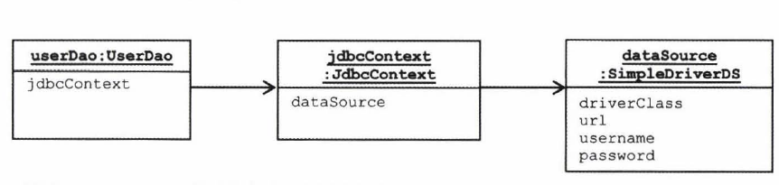
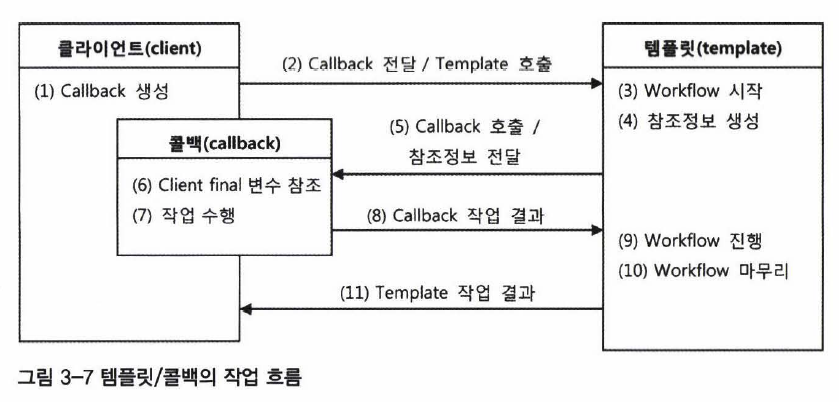
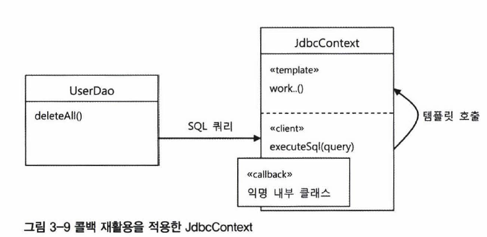

## 3.3 JDBC 전략 패턴의 최적화

- <b>목적</b> : 변하는 부분과 변하지 않는 부분을 나누어 구현했을 때 나타나는 구현상의 문제점을 살펴보고 이를 해결한다.

### 3.2절 코드의 개선해야 할 사항

~~~ java
public class AddStatement implements StatementStrategy{
    User user;
    
    public AddStatement(User user){
        this.user = user;
    }
    
    public PreparedStatement makePreparedStatement(Connection c){
        ps.setString(1,user.getId());
        ps.setString(2,user.getName());
        ps.setString(3,user.getPassword());
        ...
    }
}
~~~

여태까지 했던 구현방식은 두가지의 조건을 지켜야한다.

1. 하나의 jdbc메소드를 추가할 경우 StatementStrategy 인터페이스를 구현하여야 한다.  즉 ,하나의 메소드는 하나의 클래스파일을 생성한다.
2. 만약 데이터가 필요하면 생성자를 통해서 받아야 한다.

위 코드는 하나의 예시인 add메소드의 구현을 보여준다.

첫번째 조건은 메소드를 추가할 때 마다 클래스 파일을 생성해야 한다는 불편함이 있고 , 두번째 조건은 필요한 데이터를 받기 위하여 생성자를 정의하여야 된다는 불편점이 있다.  										     

### 해결책

위에서 제시한 불편점을 해결하는 것은 간단하다. 그 중 한가지 방법으로는 <b>로컬클래스</b>를 이용하는 방법이 있다.

#### 로컬클래스를 이용한 코드

~~~ java
public void add(final User user) throws SQLException{
   public class AddStatement implements StatementStrategy{
  
    
    public PreparedStatement makePreparedStatement(Connection c) throws SQLException {
        PreparedStatement ps = c.prepareStatement("insert into users(id,name,password) values(?,?,?)");
        
        ps.setString(1,user.getId());
        ps.setString(2,user.getName());
        ps.setString(3,user.getPassword());
      
        return ps;
    }
}
    StatementStrategy st = new AddStatement();
    jdbcContextWithStatementStrategy(st);
}
   
~~~

- 로컬 클래스 : 메소드 내에 정의된 클래스 , 클래스의 영역(scope)가 메소드 내부인 클래스

위 코드는 로컬 클래스를 이용하여 하나의 jdbc메소드 생성시 하나의 class 파일을 생성할 필요를       없게 해주고 , 또한 메소드로 들어오는 지역변수를 이용할 수 있기 때문에 따로 인수를 받을 필요가 없다. 

위의 코드에서 정의된 AddStatement 클래스는 재사용 할 수 없는 클래스 이므로 익명 클래스로 전환하는것이 바람직하다.



## 3.4 컨텍스트와 DI

- 목적 : 인터페이스가 아닌 클래스로 DI를 할수도 있는 이유와 각 방법에 대해서 알아본다.

3.3절에서의 jdbc 커넥션 객체의 이용 , 쿼리문 실행 , 자원반환 코드는 UserDao 에서만 사용 할 수 있다. 그 이유는 UserDao의 메소드로 정의를 하였기 때문이다. 

이러한 방식을 이용하면 Dao class를 정의할때마다  jdbcContextWithStatementStrategy() 메소드를 중복정의 하여야 한다. 이를 해결하기 위해 jdbcContext메소드를 하나의 class 로 분리하여야 한다.

### JdbcContext

~~~ java
public class JdbcContext {
    private DataSource dataSource;
    
    public void setDataSource(DataSource dataSource){
        this.dataSource = dataSource;
    }
    
    public void workWithStatementStrategy(StatementStrategy stmt) throws SQLException {
        Connection c = null;
        PreparedStatement ps = null;
        
        try{
            c= this.datasource.getConnection();
            ps = stmt.makePreparedStatement(c);
            ps.executeUpdate();
        }
        catch(SQLException e){
            throw e;
        }finally{
            //자원 close
        }
    }
}
~~~

이제 JdbcContex 빈을 등록하여 모든 Dao들이 하나의 JdbcContext객체workWithStatementStrategy()를 통하여 DB작업을 수행할 수 있다.

이로인한 전체적인 의존 관계는 다음과 같이 나타낼수 있다.

### 클래스의 DI

여태까지 DI를 하기 위해서는 코드 작성시 인터페이스로써 필드를 정의하고 실제 런타임시에 특정 클래스의 빈을 받도록 하였다. 하지만 이번에는 아래와 같이 UserDao 클래스에서 특정 클래스인 JdbcContex 타입의 변수를 정의해놓고 주입을 받는다.  이렇게 할 수 있는 이유는 무엇일까?

~~~ java
public class UserDao {
    private JdbcContext jdbcContext;
    
    public void setJdbcContext(JdbcContext jdbcContext){
        this.jdbcContext = jdbcContext;
    }
    
    ...
    ...
}
~~~

내가 생각하는 가장 큰 이유로는  JdbcContext가 아닌 다른방식인 JPA나 하이버네이트 같은 것을 이용할 경우 코드를 싹다 바꿔야 되므로 공통되는 인터페이스를 만들수 없기때문이다. 이러한 이유로 인터페이스가 아닌 클래스로 필드 타입을 선언해도 상관없다고 생각한다.

## 3.5 템플릿과 콜백

- 목적 : 템플릿 / 콜백 패턴에 대해 이해한다.

여태까지의 코드 사용 패턴을 부른 용어가 있는데 , 이를 <b>템플릿/콜백 패턴</b>이라고 부른다.

- 템플릿과 콜백

  - 템플릿 : 어떤 실행흐름을 가진 틀. 변경되지 않는 부분과 변경되는 부분으로 나뉜다.

  - 콜백 : 객체의 참조가 아닌 객체의 메소드 실행만을 목적으로 만들어지는 임시객체  , 생존기간은 메소드 영역

     

### 템플릿/콜백의 동작원리

(1) Callback 생성 :  익명 내부 클래스로 StatementStrategy를 구현한 객체 생성 

(2) Callback 전달 / Template 호출 : jdbcContext 객체의 workWithStatementStrategy(템플릿메소드)의 파라미터로 Callback 객체 전달 및  템플릿메소드 호출

(3) ,(4) Workflow 시작 : Connection객체 획득 및 DataSource 객체 DI 받기.

(5) Callback 호출 / 참조정보 전달 :  StatementStrategy 인터페이스를 구현한 makePreparedStatement 메소드 실행 , 매개변수로 Connection 객체를 전달.

(6),(7) Client final 변수 참조 ,작업수행 : 클라이언트의 변수 참조 및 로직 수행

(8) Callback 작업 결과 : 해당 쿼리를 실행할 PreparedStatement 객체를 반환

(9),(10) Workflow 진행 , 마무리 : 쿼리문 실행 및 자원 close

(11) Template 작업 결과 : 반환 값이 있을시 client에게 반환 (주로 select의 ResultSet)

### 콜백의 분리와 재활용

- 기본적인 원리 : 중복되는 코드 중 변경되는 부분과 변경되지 않는 부분을 분리한다.

#### 예시

<b>UserDao의 deleteAll()</b>

~~~ java
public void deleteAll() throws SQLException{
    this.jdbcContext.workWithStatementStrategy{
        //return 부분을 빼고 변하지 않음.
        new StatementStrategy(){
            public PreparedStatement makePreparedStatement(Connection c) throws
                SQLException {
                //유일하게 변하는 부분
                return c.prepareStatement("delete from users");
            }
        }
    }
}
~~~

위 코드에서 return 절의 부분만 변화가 있으므로 이를 따로 분리시킬 수 있다면 익명 내부 클래스를

생성하는 부분을 하나의 템플릿으로 분리시킬 수 있다.

분리된 코드는 다음과 같다.

#### 분리된 코드

~~~ java
//템플릿
public class JdbcContext{
    ...
        public void executeSql(final String query) throws SQLException{
        workWithStatementStrategy(
        	new StatementStrategy(){
                public PreparedStatement makePreparedStatement(Connection c) 					throws SQLException{
                    return c.prepareStatement(query);
                } 
            });
    }
}
~~~

~~~ java
//클라이언트
public void deleteAll() throws SQLException {
    this.jdbcContext.executeSql("delete from users");
}
~~~

기존의 콜백객체의 메소드는 클라이언트에서 실행된 반면 위에 처럼 코드를 작성하면 템플릿(JdbcContext)내에서 콜백객체의 메소드(executeSql)가 실행이 된다.

무엇보다 클라이언트의 관심사는 실행시키고자 하는 쿼리문으로 제한이 됨으로써 코드가 심플해진다.

 