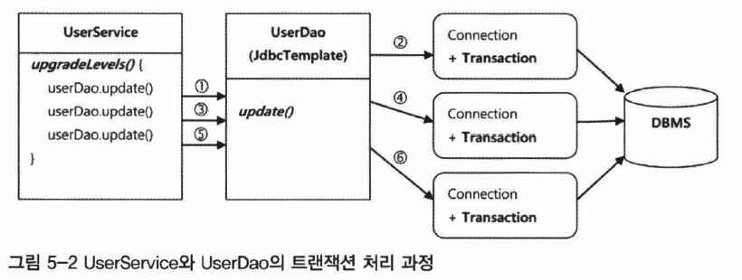
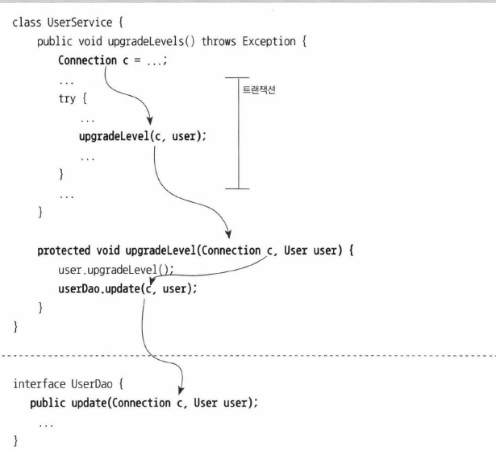
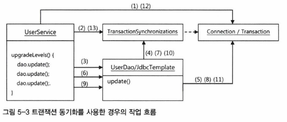
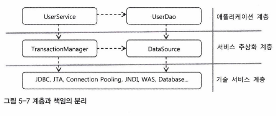

## 5.1 사용자 레벨 관리 기능 추가

- 목적 : Enum을 이용하여 사용자 레벨 관리 기능(비즈니스 로직)을 추가하여 본다.

### 5.1.1 필드 추가

<b>Level Enum</b>

사용자 레벨 (BASIC, SILVER, GOLD)를 ENUM 타입으로 정의한다.

~~~ java
package springbook .user .domain;
public enum Level {
BASIC (l) , SILVER(2) , GOLD(3);
    
private final int value;
    
Level(int value) { 
this.value = value;
public int intValue() {--을 값율 가져오는 메소드
return value;
                      }
public static Level valueOf(int value) {
switch(value) {
	case 1: return BASIC;
	case 2: return SILVER;
	case 3: return GOLD;
	default: throw new AssertionError( ‘ Unknown value: • + value);
		}
	}
}

~~~

그 후 User class에 field 추가 및 테스트 작업을 거친다.

### 5.1.2 사용자 수정 기능 추가

사용자 수정 기능을 하는 update()를  UserDao에 추가한다.

~~~ java
public void update(User user) {
this.jdbcTemplate .update(
"update users set name = ? password = ?, level = 7, login = ?, " +
"recommend = ? where id = ?", user.getName() , user.getPassword() ,
user.getLevel().intValue() , user.getLogin() , user.getRecommend() ,
user. getId());
}
~~~

### 5.1.3 UserService.upgradeLevels()

사용자 레벨 관리를 하는 메소드인 upgradeLevels()를 비즈니스 로직만 처리하는 UserService단에

넣는다.

~~~ java
public void upgradeLevels() {
List<User) users = userDao.getAll();
for(User user users) {
Boolean changed = null;
if (user.getLevel() == Level.BASIC && user.getLogin() >= 50) {
user .setLevel(Level.SILVER);
changed = true;
}
else if (user.getLevel () == Level.SILVER && user.getRecαrrnend 0 >= 30) {
user.setLevel (Level.GOLD ); 
changed = true;
else if (user.getLevel() == Level.GOLD) { changed = false; }
else { changed = false; } 
} 
lf (changed) { userDao.update(user); }
	}
}
~~~

### 5.1.4 UserService.add()

처음 가입하는 사용자는 기본적으로 BAISC 레벨이어야 한다 , 이 메소드를 add()라고 하고

UserService에 추가한다.

~~~ java
public void add(User user) {
if (user.getLevel() == null) user .setLevel(Level .BASIC);
userDao .add(user); 
}
~~~

## 5.2 트랜잭션 서비스 추상화

5.1절에서 만든 사용자 레벨관리 메소드는 중간에 DB에 장애가 발생했을 시 일부는 작업이 처리되고 일부는 처리가 되지 않는 문제점이 발생한다.                                                                                              이를 해결해주기 위해서 사용자 레벨관리를 하나의 트랜잭션으로 묶는 작업을 해야한다.

### 5.2.1 모 아니면 도

예외를 강제로 발생시켜 장애를 만든 후 기존 코드의 문제점을 파악한다.

~~~ java
@Test 
public void upgradeAIIOrNothing() { 
UserService testUserService = new TestUserService(users.get(3).getId());
testUserService.setUserDao(this . userDao);
userDao.deleteAll();
for(User user users) userDao.add(user);
try {
τestUserService.upgradeLevels();
fail( "TestUserServiceException expected");
	}
	catch(TestUserServiceException e){
	}
checkLevelUpgraded(users.get(l) , false);
}
~~~

기존 upgradeLevels()는 트랜잭션의 원자성을 지키지 않는 코드이다.

### 5.2.2 트랜잭션 경계설정

트랜잭션의 시작과 끝을 정함으로써 트랜잭션 코드를 작성한다.

~~~ java
Connection c = dataSource.getConnection();

c.setAutoCommit(false);
try {
    
PreparedStatement stl
	c.prepareStatement("update users ... ");
stl.executeUpdate();
    
PreparedStatement st2 =
	c. prepareStatement( "delete users ... ");
st2.executeUpdate();
	c. commi t();
}
catch(Exception e) {
c . rollback();
}
c. close() ;
~~~

- 위코드의 문제점

UserDao 객체의 update() 메소드 호출시 Connection 객체를 생성하고 회수하는 작업을 반복한다.   이러한 코드는 성능 저하의 주된 원인이므로 이를 해결하기 위하여 Connection 객체는 하나의 트랜잭션 안에서 하나만 쓰일 수 있도록 개선해야 한다.

#### 개선된 코드

### 5.2.3 트랜잭션 동기화

트랜잭션 동기화를 통하여 트랜잭션 경계 문제를 해결한다.

트랜잭션 동기화는 Spring이 제공해주는 TransactionSynchronizations class를 이용하여 구현할 수 있고 작업 흐름으 다음 그림과 같다.

#### 트랜잭션 동기화 적용 코드

~~~ java
private DataSource dataSource;
public void setDataSource(DataSource dataSource) {
	this.dataSource = dataSource;
}
public void upgradeLevels() throws Exception {
TransactionSynchronizationManager.initSynchronization();
Connection c = DataSourceUtils.getConnection(dataSource);
c.setAutoCommit(false);
try {
List<User> users = userDao.getAll();
for (User user users) {
if (canUpgradeLevel(user)) {
upgradeLevel(user);
c.commit () ; 
} catch (Exception e) {
c.rollback () ; 
throw e;
} finally { 
DataSourceUtils.releaseConnection(c, dataSource );
TransactionSynchronizationManager.unbindResource (this.dataSource);
TransactionSynchronizationManager.clearSyncronization();
	}
}
~~~

### 5.3 단일 책임 원칙

- 단일 책임 원칙 : 객체지향 설계 원칙중 하나로써 하나의 모듈은 한가지 책임을 가져야 한다는 의미

앞의 코드를 단일 책임 원칙을 지키도록 계층과 책임을 분리하면 다음과 같다.

<b>단일 책임 원칙의 장점</b>

- 어떤 변경이 필요할 때 수정 대상이 명확해진다.
- 적용하는 과정에서 여러 디자인 패턴들을 자연스레 적용할 수 있다.